# Trayfinity Workbench 	

_Infinite possibilities in generating gridfinity assortment trays._

## Overview

This workbench can be used to generate subdivided trays, compatible with Zack Freedman's gridfinity
system. You can use it in three ways:

  1. Generate a simple tray with regular row and column divisions.
  2. Layout your own tray the way you would an html table.
  3. Generate your own features.

2 and 3 can be mixed, so you can generate your own content in place of any cell. 

For option 1, simply open `trayfinity.scad` and use the customizer.

## A simple tray

All of the code samples below assume these two includes:  
```
use <trayfinity-modules.scad>
include <trayfinity-constants.scad>
```

Generating a tray is a two-step process: first create the data structure that describes the tray,
then generate the tray from the data structure.

```
definition = build_tray_definition(
  width_units = 5,
  depth_units = 5,
  height_units = 8,
  label_placement = "column",
  layout = generate_layout(num_columns = 4, num_rows = 3)
);
  
trayfinity_tray(definition);  
```
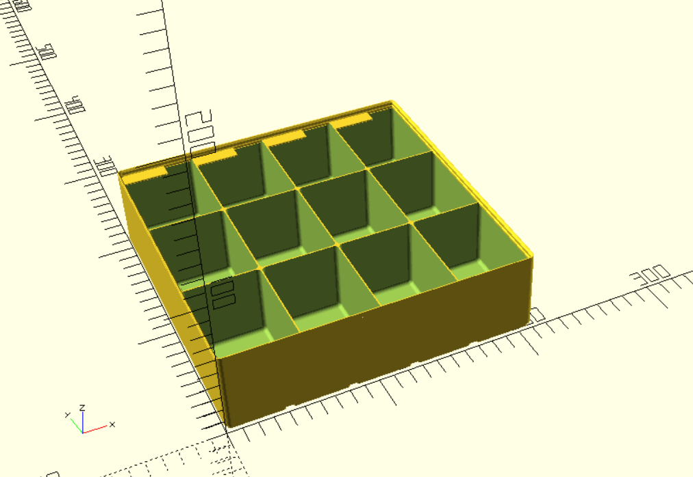

The `generate_layout()` function will generate a simple layout with the specified number
of columns and rows.

## Tray definition 

Below is a desciption of the parameters that the `build_tray_definition()` function accepts. 

### Tray properties

| property                   | Default    | Description                                                                                                                       |
|----------------------------|------------|-----------------------------------------------------------------------------------------------------------------------------------|
| width_units                | 5          | X dimension in grid units (multiples of 42 mm).                                                                                   |
| depth_units                | 3          | Y dimension in grid units (multiples of 42 mm).                                                                                   |
| height_units               | 4          | Z dimension (multiples of 7 mm + 4.75 mm for the bottom interface)                                                                |
| layout                     |            | Layout specification as generated with the `generate_layout()` function.                                                          |
| column_widths              | []         | Relative column widths. Unspecified column widths are assumed to be 1.                                                            |
| row_depths                 | []         | Relative row depths. Unspecified row depths are assumed to be 1.                                                                  |
| wall_thickness             | 0.95       | Thickness of the outer wall.                                                                                                      |
| divider_thickness          | 0.9        | Width of internal subdividers.                                                                                                    |
| lip_size                   | "standard" | Size of the lip. Possible values: "standard", "reduced", "none".                                                                  |
| magnet_diameter            | 6.5        | Diameter of the cutouts for the magnets. The design default is 6.5 mm. The depth of the hole will be 2.4 mm. Set to 0 to disable. |
| screw_depth                | 4.75       | Depth of the cutouts for the screws. The design default is 4.75 mm. The diameter of the hole will be 3 mm. Set to 0 to disable.   |
| corner_attachments_only    | false      | Only add attachments (magnets and/or screws) to tray corners.                                                                     |
| attachment_overhang_remedy | true       | Add extra feature in attachement holes to allow your slicer to use bridges. Only when both screws and magnets are enabled.        |
| bottom_interface_divide    | 1          | Subdivide bottom interface pads. Max is 4 if no attachments specified.                                                            |

### Default cell properties

For all but a few cell properties, defaults can be specified at the tray level, so you don't have to repeat them for
each cell. You can override these properties on a cell-by-cell basis, by only specifying the properties that must
be overridden for that cell.

_Basic layout properties:_

| property           | Default | Description                                                                                                                                                                       |
|--------------------|---------|-----------------------------------------------------------------------------------------------------------------------------------------------------------------------------------|
| floor_thickness    | 0.8     | Minimum thickness above bottom interface or screw holes if a `screw_depth` of more than 4.75 is specified.                                                                        |
| fillet_radius      | 0       | Fillet radius of the inside of a cell. Set to 0 to default to 3.75 - wall_thickness. On the corners of the tray the default is the minimum to guarantee a minimum wall thickness. |
| fingerslide_radius | 11      | Include larger fillet at the front side of each cell. Set to a value below fillet_radius  to disable.                                                                             |

_Label properties:_

| property           | Default           | Description                                                                               |
|--------------------|-------------------|-------------------------------------------------------------------------------------------|
| label_placement    | "all"             | Include overhang for labeling. Possible values: "all", "column", "row", "single", "none". |
| label_align        | "left"            | Alignment of the label. Possible values: "left", "right", "center", "full".               |
| label_width        | 30                | Width of the label in mm.                                                                 |
| label_depth        | 10                | Depth of the label in mm.                                                                 |

_Label text properties:_

| property           | Default           | Description                                                                                                                                                                           |
|--------------------|-------------------|---------------------------------------------------------------------------------------------------------------------------------------------------------------------------------------|
| font               | "Liberation Sans" | Font to use for the label. See the [OpenSCAD documentation](https://en.wikibooks.org/wiki/OpenSCAD_User_Manual/Text#Using_Fonts_&_Styles) for details.                                |
| font_size          | 5                 | Size of the label text. This is roughly the vertical size of the letters in mm.                                                                                                       |
| text_color         | "black"           | Text color is mainly used for exporting labels of a certain color for multicolor printing. You can specify a color name or hex value.                                                 |
| text_height        | 0.0               | How far the text sticks out of the label. This setting effectively moves the label down instead of moving the text up. This to ensure that the text does not interfere with stacking. |
| text_depth         | 0.3               | How deep the text is carved out of  the label.                                                                                                                                        |
| text_margin_v      | 1.0               | Margin on the left for label text or at the right when label_align == "right".                                                                                                        |
| text_margin_h      | 1.0               | Margin at the bottom for label text.                                                                                                                                                  |

## Custom layouts

### Defining a layout

For defining a layout, there are 2 functions: `row()` and `cell()`. `row()` has a single
parameter: an array of cells. For the `cell()` parameters, see next section.

```
layout = 
  [  
    row(
      [ 
        cell(1, 1),
        cell(1, 1)
      ]
    )
  ];
  
trayfinity_tray(build_tray_definition(layout = layout));
```
The `colspan` and `rowspan` work as in an html table:
```
layout = 
  [  
    row(
      [ 
        cell(1, 2),
        cell(2, 1)
      ]
    ),
    row(
      [ 
        cell(1, 1),
        cell(1, 1)
      ]
    )
  ];
  
trayfinity_tray(build_tray_definition(layout = layout));
```
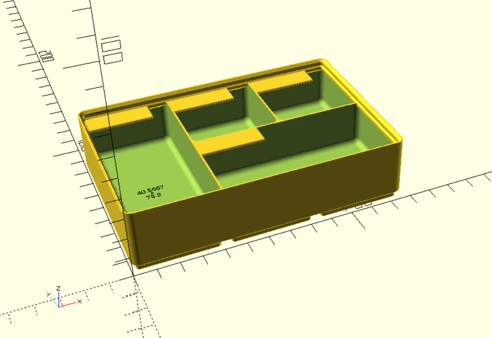

### Cell properties

The `cell()` function accepts the following parameters for setting the properties.  

_Basic layout properties:_

| property           | Default | Description                                                                                                                   |
|--------------------|---------|-------------------------------------------------------------------------------------------------------------------------------|
| colspan            | 1       | Span the cell over this many columns. This will always be the first parameter, so you can use it positionally.                |          
| rowspan            | 1       | Span the cell over this many rows. This will always be the second parameter, so you can use it positionally.                  |          
| floor_thickness    | 0.8     | Minimum thickness above cutouts in base (Zack's design is effectively 1.2).                                                   |
| fillet_radius      | 2.75    | Fillet radius of the inside of the cells                                                                                      |
| fingerslide_radius | 11      | Include larger fillet at the front side of each cell. Set to a value below fillet_radius  to disable.                         |

_Label properties:_

| property           | Default           | Description                                                                                                                   |
|--------------------|-------------------|-------------------------------------------------------------------------------------------------------------------------------|
| label_placement    | "all"             | Include overhang for labeling. Values: "all", "column", "row", "single", "none"                                               |
| label_align        | "left"            | Alignment of the label. Valus: "left", "right", "center", "full"                                                              |
| label_width        | 30                | Width of the label in mm                                                                                                      |
| label_depth        | 10                | Depth of the label in mm                                                                                                      |
| label_text         |                   | The text to be printed on top of or embedded into the label                                                                   |

_Label text properties:_

| property           | Default           | Description                                                                                                                                            |
|--------------------|-------------------|--------------------------------------------------------------------------------------------------------------------------------------------------------|
| font               | "Liberation Sans" | Font to use for the label. See the [OpenSCAD documentation](https://en.wikibooks.org/wiki/OpenSCAD_User_Manual/Text#Using_Fonts_&_Styles) for details. |
| font_size          | 5                 | Size of the label text. This is roughly the vertical size of the letters.                                                                              |
| text_color         | "black"           | Text color is mainly used for exporting labels of a certain color for multicolor printing. You can specify a color name or hex value.                  |
| text_height        | 0.0               | How far the text sticks out of the label.                                                                                                              |
| text_depth         | 0.3               | Default is text embedded by 0.3 mm into label surface                                                                                                  |
| text_margin_v      | 1.0               | Margin on the left for label text or at the right when label_align == "right"                                                                          |
| text_margin_h      | 1.0               | Margin at the bottom for label text.                                                                                                                   |

_Other properties:_

| property     | Default | Description                                                                                                               |
|--------------|---------|---------------------------------------------------------------------------------------------------------------------------|
| generate     | true    | Generate this cell. If false, the space is left blank for the user to define (more on this below).                        |
| ref          |         | A string for referencing this cell. See "Creating your own features" below for usage. A `ref` does not have to be unique. |
| user_defined |         | Here you can put in any data you like for generating your own cells.                                                      |


### Label texts

You can generate text on the labels. You can opt for inset, outset or flush labels. 
The latter will only work with color printing. The `trayfinity_tray` module 
will generate no text on the labels. Because you need separate text shapes for 
multicolor printing, there is a separate module to generate the text:
```
tray_label_texts(tray_definition);
```
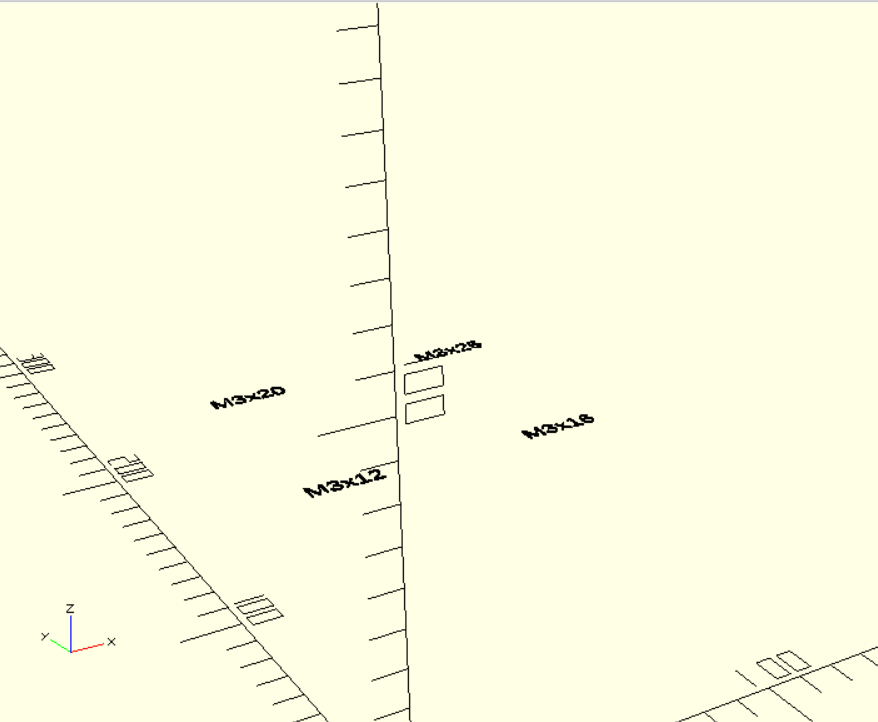

To have inset text, specify a `text_depth` and subtract the labels from the tray:

```
definition = build_tray_definition(
  width_units = 3,
  depth_units = 3,
  height_units = 8,
  label_placement = "all",
  text_depth = 0.5,
  layout = [
    row(
      [ 
        cell(1, 1, label_text = "M3x12"),
        cell(1, 1, label_text = "M3x16")
      ]
    ),
    row(
      [
        cell(1, 1, label_text = "M3x20"),
        cell(1, 1, label_text = "M3x25")
      ]
    )
  ]
);
  
difference() {
  trayfinity_tray(definition); 
  tray_label_texts(definition);
}
```

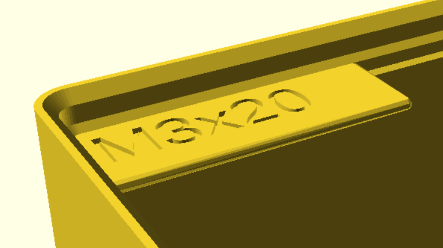

And for outset, specify the text height and make a union:
```
definition = build_tray_definition(
  width_units = 3,
  depth_units = 3,
  height_units = 8,
  label_placement = "all",
  text_height = 0.5,
  layout = [
      row(
        [ 
          cell(1, 1, label_text = "M3x12"),
          cell(1, 1, label_text = "M3x16")
        ]
      ),
      row(
        [
          cell(1, 1, label_text = "M3x20"),
          cell(1, 1, label_text = "M3x25")
        ]
      )
    ]
);
  
union() {
  trayfinity_tray(definition);
  tray_label_texts(definition);
}
```
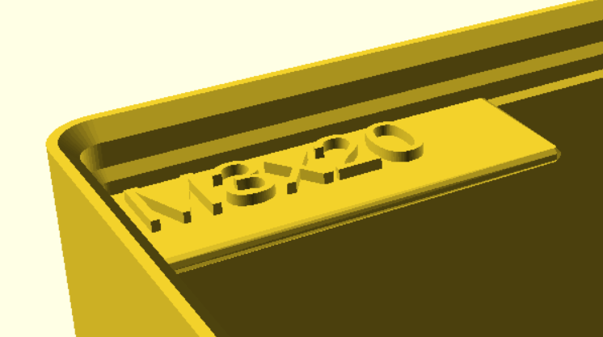

Note that the labels will move down by the specified `text_height` when creating
outset labels. This is so that the lettering does not interfere with stacking.

### Multicolor printing

For multicolor printing, set the `text_height` to 0 and the `text_depth` to the layer
height you use for printing. Then generate the tray with inset text and separately
generate and export the label. Then you can combine them in your slicer.

You can have labels in different colors. For that, specify the `text_color` for the
cell and specify the `color_selection` parameter when rendering texts.
```
definition = build_tray_definition(
  width_units = 3,
  depth_units = 3,
  height_units = 8,
  label_placement = "all",
  text_depth = 0.3,
  layout = [
      row(
        [ 
          cell(1, 1, label_text = "M3x12", text_color = "black"),
          cell(1, 1, label_text = "M3x16", text_color = "red")
        ]
      ),
      row(
        [
          cell(1, 1, label_text = "M3x20", text_color = "black"),
          cell(1, 1, label_text = "M3x25", text_color = "red")
        ]
      )
    ]
);
  
union() {
  trayfinity_tray(definition);
  tray_label_texts(definition);
}       
```


To just render the blue labels for exporting:
```
tray_label_texts(tray_definition, color_selection = "red");
```
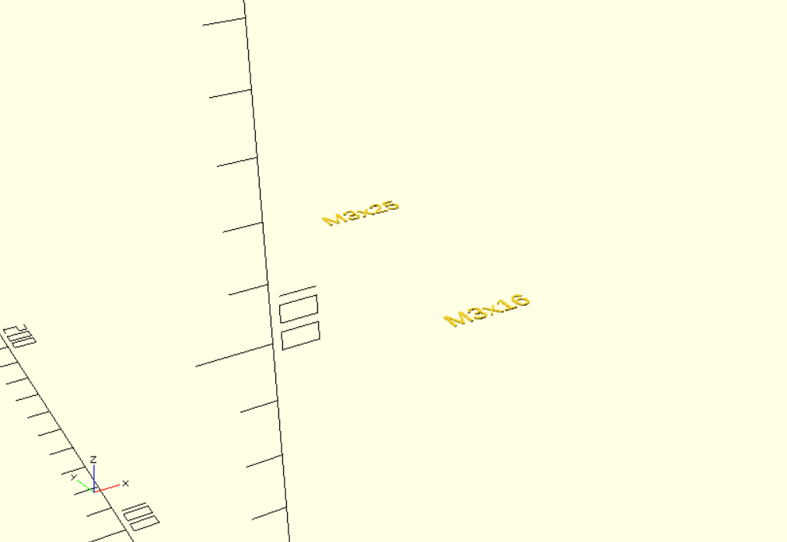

## Creating your own features

### Defining a blank cell

The first thing to do is to instruct the Trayfinity Workbench to skip rendering the cell 
where you want your custom feature to be. This is done using the cell property `generate`:
```
layout = 
  [  
    row(
      [ 
        cell(1, 1),
        cell(1, 1, generate = false)
      ]
    )
  ];
  
trayfinity_tray(build_tray_definition(layout = layout));
```
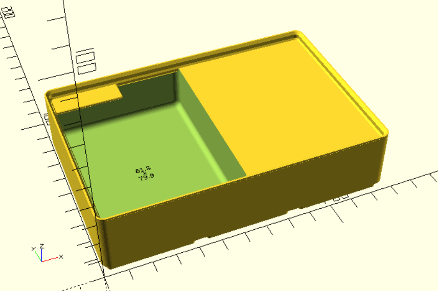

To put your own content there, you must get the cell from the gridded_layout. Use
the `ref` property for that. If you will, you can get the bounding box so you know
the volume that is available. Your featuer will be positioned automatically by 
the Trayfinity Workbench, so your only worry is what volume is available to you.
```
layout = 
  [  
    row(
      [ 
        cell(1, 1),
        cell(1, 1, generate = false, ref = "my_cell")
      ]
    )
  ];
definition = build_tray_definition(layout = layout);  
my_cell = find_cell(ref = "my_cell", tray_definition = definition);

cube(my_cell[BOUNDING_BOX][SIZE]);
```
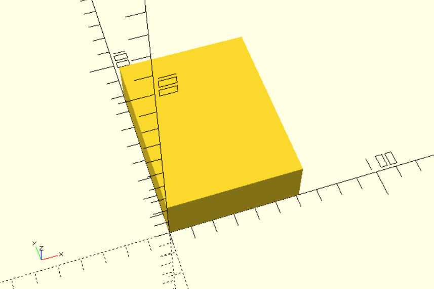

### Adding your feature

Use the `custom_cell` module to add your feature in the blank space 
```
layout = 
  [  
    row(
      [ 
        cell(1, 1),
        cell(1, 1, generate = false, ref="my_cell")
      ]
    )
  ];
definition = build_tray_definition(layout = layout);  

trayfinity_tray(definition) {
  custom_cell(ref = "my_cell", tray_definition = definition) {
    my_cell = find_cell(ref = "my_cell", tray_definition = definition); 
    cube(my_cell[BOUNDING_BOX][SIZE]);
  }  
}
```
The shape of your feature will be automatically bounded to the volume 
available for the cell. Even if the shape goes outside the available volume, it will
your tray will still be valid. Eg:
```
trayfinity_tray(definition) {
  custom_cell(ref = "my_cell", tray_definition = definition) {
    cylinder(r = 30, h = 100, center = true);
  }  
}
```
Defines this feature:
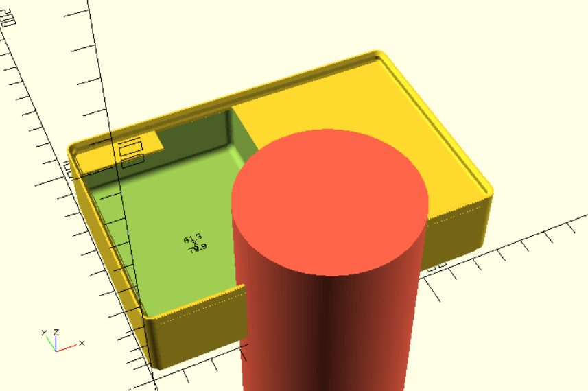

But the resulting tray will look like this:
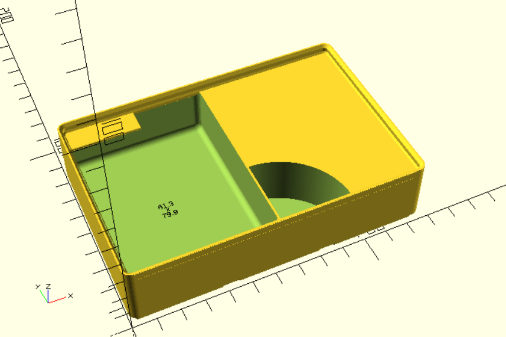

Note that the bounding box respects the fingerslide, which is on by default. This 
means the front side of the bounding box is flush with the lip. If you want your 
feature to use all available space, disable the fingerslide:
```
cell(1, 1, generate = false, ref="my_cell", fingerslide_radius = 0),
```
### User defined cell properties

There is a possibility to provide your own property (or properties if you use an
array), as demonstrated here: 
```
layout = 
  [  
    row(
      [ 
        cell(1, 1),
        cell(1, 1)
      ]
    ),
    row(
      [ 
        cell(1, 1, generate = false, ref = "my_cell", user_defined = 5),
        cell(1, 1, generate = false, ref = "my_cell", user_defined = 8)
      ]
    )
  ];
definition = build_tray_definition(layout = layout);  

trayfinity_tray(definition) {
  for (my_cell = find_cells(ref = "my_cell", tray_definition = definition)) 
    custom_cell(definition, cell = my_cell) {
      translate([20, 20, 0])
      cylinder(r = my_cell[USER_DEFINED], h = 100);
    }  
}
```
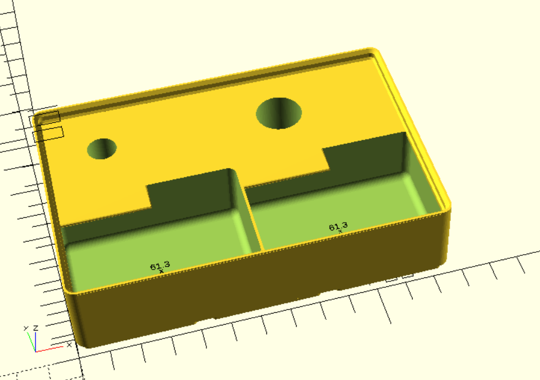


## Freestyle tray

You can also generate a completely blank tray and not use any of the cell 
layouting features. Add the features as children. There is automatic bounding
to the tray shell, as with custom cells.

Defining this feature:
```
freestyle_tray(
  width_units = 3,
  depth_units = 3,
  height_units = 7
) { 
  for (row = [ 1 : 15 ])
    for (col = [1 : 15])
      translate([col * 12, row * 12, 0]) 
      cylinder(r = 3, h = 100, center = true);
}
```
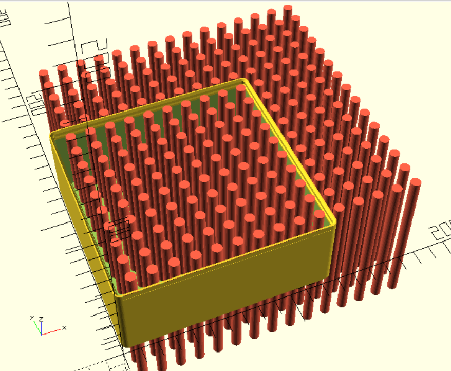
    
Results in this:
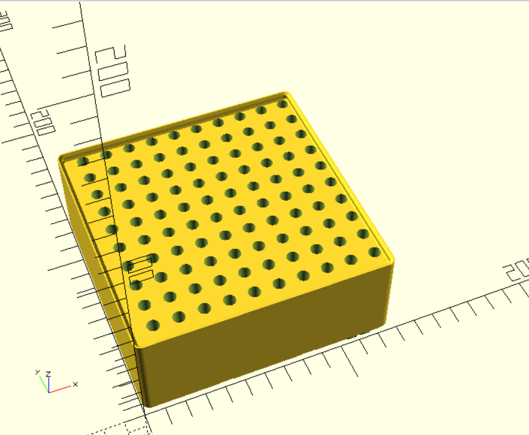
 
